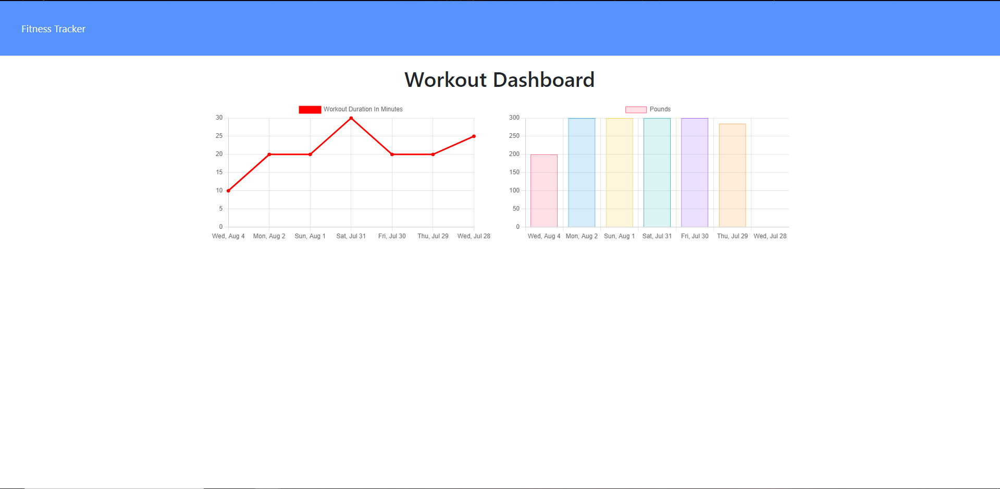

# Dwarven Workout Tracker 
[](https://github.com/SamuelMontague/workoutTracker)
  
#Description

This is a website that will help track a user's exercises. The site allows a user to track a new exercise for the day or update a previously created exercise. The site tracks total exercises, total time, total weight lifted for each day. 

 

    
# Table of Contents

* [Installation](#installation)
    
* [Usage](#usage)

* [License](#license)

* [Contributing](#contributing)

* [Technology](#Technology)

* [Questions](#questions)
    
# Installation
Clone the repo to your local machine.

Run ```npm install``` to install dependencies.

Run ```node server.js``` to start the application.

# Usage

Create a new workout. Or add to an existing workout.
Choose workout type either resistance or cardio.
Fill out the details for your exercises and add to continue.
View your progress over time on the dashboard and current stats on the homepage.

#License

This application is covered by the MIT license.
    
# Contributing

Contributors: Samuel Montague

# Technology

MangoDB 
    - used to host the data. Built for modern application developers.

Mongoose
    - Mongoose uses MongoDB for object modeling.
    - Is a schema based solution to model your app data.

Express
    -  Express is a minimal and flexible Node.js application.


    
# Questions

If you have any questions about the repo, open an issue or contact me directly at SamuelpMontague@gmail.com. You can find more of my work at (https://github.com/SamuelMontague/).
